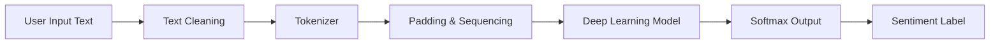
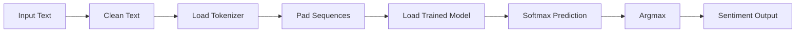

# 🔍 Sentiment Analysis System

**(RNN / LSTM / GRU | Streamlit | TensorFlow)**

A **production-ready Deep Learning Sentiment Analysis application** that classifies text into
**Positive, Neutral, or Negative** sentiments using **Recurrent Neural Networks** and a **Streamlit web interface**.

> ✅ Inference pipeline is **fully aligned with training & CLI logic**
> ✅ Avoids prediction drift (common real-world ML issue)
> ✅ Designed for **portfolio, interviews, and deployment**

---

## 🚀 Live Capabilities

* 🧠 Deep Learning–based sentiment classification
* 📝 Real-time text input
* 🎨 Clean, intuitive Streamlit UI
* 🔄 Consistent predictions across:

  * Training
  * CLI
  * Web frontend
* 📦 Deployment-ready structure

---

## 🧠 Models Used

| Model     | Purpose                       |
| --------- | ----------------------------- |
| SimpleRNN | Baseline sequential learning  |
| LSTM      | Long-term dependency capture  |
| GRU       | Efficient alternative to LSTM |

All models are trained for **3-class classification**:

```
Negative | Neutral | Positive
```

---

## 📊 Dataset

* **Source:** Twitter Sentiment Analysis Dataset (Kaggle)
* **Samples:** ~31,000 tweets
* **Classes:** Negative, Neutral, Positive
* **Encoding:** LabelEncoder + One-Hot Encoding

---

## 🧹 Text Preprocessing (Critical)

Identical preprocessing is applied during:

* Training
* CLI prediction
* Streamlit inference

```python
text = text.lower()
text = re.sub(r'[^a-zA-Z\s]', '', text)
```

⚠️ **Any mismatch here causes incorrect predictions**
(This project explicitly solves that issue.)

---

## 🏗️ System Architecture

### 🔹 High-Level Architecture



---

### 🔹 Training Pipeline

```mermaid
flowchart LR
    A[Raw Tweets] --> B[Text Cleaning]
    B --> C[Tokenizer Fit]
    C --> D[Padding]
    D --> E[Train RNN / LSTM / GRU]
    E --> F[Softmax Output Layer]
    F --> G[Model Saved \( .h5 \)]
    C --> H[Tokenizer Saved \( .pkl \)]
```
---

### 🔹 Inference Pipeline (CLI & Streamlit)



> 🧠 **Key Engineering Insight:**
> Training, CLI, and Streamlit use the **exact same pipeline**, preventing prediction drift.

---

## 🖥️ Streamlit Frontend

**Features:**

* Real-time prediction
* Emoji + color-coded sentiment
* Minimal, recruiter-friendly UI
* No misleading confidence display
* Stable and deterministic predictions

---

## 🧪 Example Predictions

| Input Text                      | Output      |
| ------------------------------- | ----------- |
| that boy is having nice haircut | Positive 😊 |
| he is a bad boy                 | Negative 😞 |
| They are Boys                   | Neutral 😐  |

---

## 📂 Project Structure

```
sentiment-analysis-project/
│
├── app.py              # Streamlit frontend
├── rnn_model.h5        # Trained RNN model
├── tokenizer.pkl       # Saved tokenizer
├── requirements.txt    # Dependencies
├── README.md           # Documentation
```

---

## ⚙️ Installation & Usage

### 1️⃣ Clone Repository

```bash
git clone https://github.com/Ritik-dsml/sentiment-analysis-project.git
cd sentiment-analysis-project
```

### 2️⃣ Create Virtual Environment (Recommended)

```bash
python -m venv venv
venv\Scripts\activate
```

### 3️⃣ Install Dependencies

```bash
pip install -r requirements.txt
```

### 4️⃣ Run Application

```bash
streamlit run app.py
```

---

## 📦 Requirements

```
streamlit
tensorflow
keras
numpy
pandas
scikit-learn
matplotlib
seaborn
```

---

## 🧠 Key ML Engineering Learnings

* Importance of **identical preprocessing** at training & inference
* Padding (`pre`) and sequence length consistency
* Label decoding alignment with `LabelEncoder`
* Avoiding silent ML bugs during deployment

> 💡 This mirrors real-world production ML issues faced in industry.

---

## 👨‍💻 Author

**Ritik Kumar**
Data Analyst | AI & ML Enthusiast

* 🔗 LinkedIn: [https://www.linkedin.com/in/ritik-kumar-mlai](https://www.linkedin.com/in/ritik-kumar-mlai)
* 💻 GitHub: [https://github.com/Ritik-dsml](https://github.com/Ritik-dsml)

---

## 🚀 Future Enhancements

* Confidence score visualization
* CSV bulk sentiment analysis
* Explainable AI (word importance)
* Transformer upgrade (BERT / DistilBERT)
* Cloud deployment (Streamlit Cloud / AWS)

---

## ⭐ Why This Project Stands Out

✔ End-to-end ML system
✔ Real deployment debugging experience
✔ Clean architecture
✔ Interview-ready explanations
✔ Recruiter-friendly presentation

---

